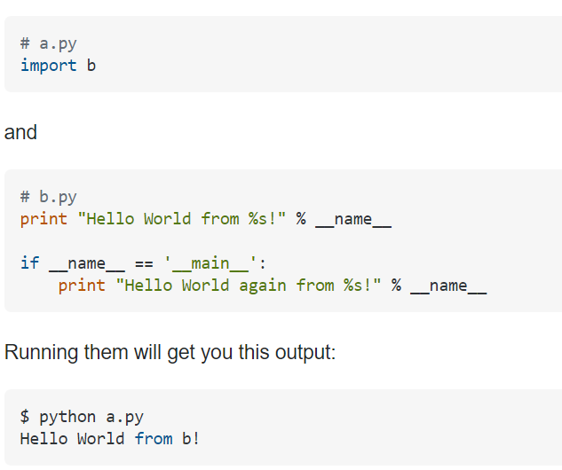

**The 'Shebang' in Python** 

What is it and how does it look like?
Shebang allows for Python script to execute on the terminal
or system without the need to specify something like this 
on the shell: `$ python my_script.py` ...

Instead, we can use `$ ./my_script.py`

To make this possible, we need to add the following line to
our script. Best placed at the top and it's

Example: Using 'python' defaults to Python 2.7
You can find out what version your system default is by
using this command on the Linux terminal

`#!/usr/bin/env python`

Example: You can specify which Python versions to use
`#!/usr/bin/env python3`

**The 'if __name__ == "__main__":'**

Check this for context and usage
[https://stackoverflow.com/questions/419163/what-does-if-name-main-do][]

Look at this example script for context:

Script a.py imports script/module b.py
because a.py is not the 'main', only script execute is 