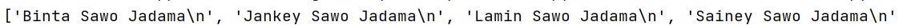

## **Difference Between _File_ Modes**

'r' = read the file
\
'w' = write the file as if it's new. Deletes all pre-existing data
\
'a' = appends new additions for existing data file
\
'r+' = enables the file for both read and write
\
'a+' = enables the file for both read and appending
\
'w+' = enable the file for both write and read
***
## **Difference Between _read_ Modes**

Sample code:

`file_input = open('names.txt', 'r')`
\
`names = file_input.[placeholder]()`

* **Read all the lines and print as it looks like in the file**

`names = file_input.read()`
\
`print(names)`

_An example output for `print(names)` will look like this:_

* **Read a single line from the file**

> The first line, whether it contains data or not, will be read.

`name = file_input.readline()`
\
`print(name)`

An example out for `print(name)` will look like:

* **Read the file line by line until all lines are read**

> Each line is treated as an item. When printed, the lines appear as a list,
with each enclosed in quotes ('') and separated by commas (,).

This will  read all the lines in the file, one by one

`names = file_input.readlines()`
\
`print(names)`
\

An example output 

> We can iterate through this list and print all the names using a loop:

This prints the names one-by-one. See below for example output:

## **Other read modes**

- Read _file_ by **buffer size** or number of characters with read()
> In the example we will read on 10 characters (or a buffer size of 10).
> Note that spaces are also considered as characters. For example:

`names_input = open('names.tx', 'r')`
\
`names = names_input.read(5)`
\
`print(names)`

Let's assume the name on the first line of the file is 'Binta Sawo'. When we run the script, it will read only
the first 5 characters of the file. Those 5 characters happen to read 'Binta' and therefore 'Binta' will be our output.

- Read _lines_ by number of chars (characters or buffer size)

> Example below reads a single line and for only 8 characters and stop. If name in first line is '_Binta Sawo_',
> the output will be 'Binta Sa' (this string contains 8 chars, including the space)

`names_input = open('names.tx', 'r')`
\
`names = names_input.readline(5)`
\
`print(names)`

## Difference between _write_ Modes

- write() - write all at once
- writelines() - write line-by-line

**This file is edited using Markdown language. Learn more here:**
<https://www.markdownguide.org/getting-started/>